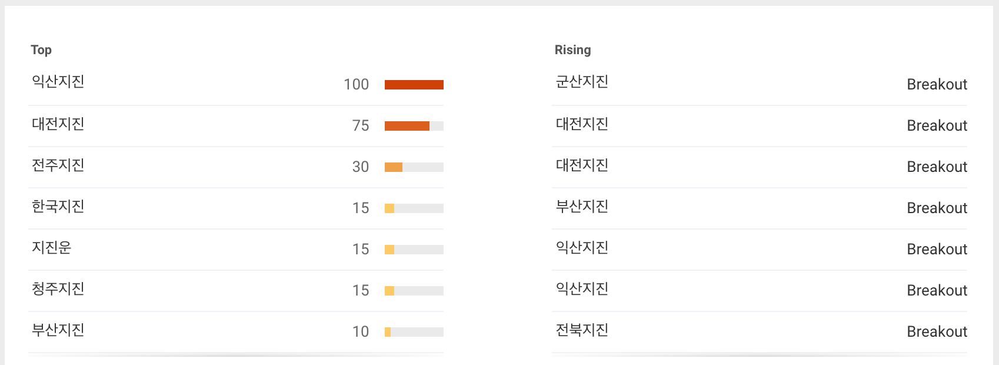

# google-releated-searches

scrap related searches on Google.

[](https://github.com/feross/standard)

[ ](https://www.npmjs.com/package/google-releated-searches)

## Important

* The unofficial module to crawl the content of the site.
* Therefore, whenever it may not be a normal operation, if problems occur, please add the issue.


## Related searches
People whose searches match the restrictions most often searched for these terms too.

[Go to explore page](https://www.google.com/trends/explore#q=%EC%A7%80%EC%A7%84&date=now+7-d&geo=KR)




## Usage

```javascript
var related = require('./')

related.load({ term: '지진', countries: ['kr'] }, function (err, result) {
  console.log(err, JSON.stringify(result))
})

```

```javascript
// output
{
  "kr": {
    "top": [
      {
        "term": "군산지진",
        "link": "https://www.google.com/search?q=%EA%B5%B0%EC%82%B0%EC%A7%80%EC%A7%84",
        "value": null
      },
      // ...
      {
        "term": "지진운",
        "link": "https://www.google.com/search?q=%EC%A7%80%EC%A7%84%EC%9A%B4",
        "value": 450
      }
    ],
    "rising": [
      {
        "term": "익산지진",
        "link": "https://www.google.com/search?q=%EC%9D%B5%EC%82%B0%EC%A7%80%EC%A7%84",
        "value": 100
      },
      // ...
      {
        "term": "전북지진",
        "link": "https://www.google.com/search?q=%EC%A0%84%EB%B6%81%EC%A7%80%EC%A7%84",
        "value": 10
      }
    ]
  }
}
```

## List of Google domains

https://en.wikipedia.org/wiki/List_of_Google_domains

## LICENSE

google-releated-searches is licensed under the MIT license.
